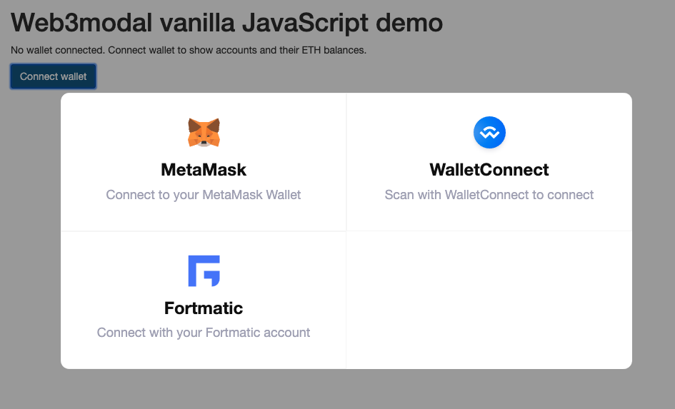
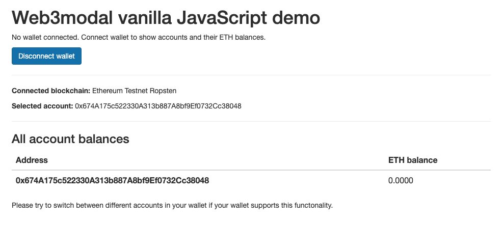

## This repositor has been archived. Please visit [web3modal.com](https://web3modal.com/) for latest examples.


***


This is a vanilla JavaScript example how to use Web3modal with different  wallet providers.

The purpose of this example is how to connect a cryptocurrency wallet
to a website that is build on traditional HTML technologies and does not
use any modern JavaScript framework. Uses cases would include:
static HTML sites, WordPress, content management systems,
tutorials and education.

The example works with

* In-browser wallets (MetaMask, Opera, Brave),

* Mobile wallets through QR code scanning (WalletConnect)

* Account-based wallets (Fortmatic, others)

The code uses simple unprocessed in-browser JavaScript.
Dependencies, like the Web3Modal library itself,
are loaded over Unpkg CDN. The code is extensively
commented and short.

* [View demo hosted on Github](https://web3modal.github.io/web3modal-vanilla-js-example/)





# What should I do with this

[Web3modal](https://github.com/web3modal/web3modal)) is a vendor-neutral project
offering an easy integration of cryptocurrency and
decentralised finance for websites. For example, you can use this to start
accepting cryptocurrency payments on your site or to start
building a decentralised finance application.

# Support

[Go to Web3modal main Github repository](https://github.com/web3modal/web3modal).

Reach to us in [Web3modal Discord](https://discordapp.com/invite/YGnSX9y) or open a Github issue.

# Web3 wallets and HTTPS hosting limitations

Because of limitations how wallet operate within a web browser
and web security,
you should not run this example, or any Web3modal code,
out of your file system or insecure HTTP protocol
(even using localhost).

The APIs of different wallet providers
may fail in funny and obscure way.
MetaMask does not even show up if you load it over `file://`
protocol.

The easiest way to get local HTTPS development
is to use [https-localhost](https://github.com/daquinoaldo/https-localhost).

Assuming you have a working Node environment set up on a UNIX
system you can do:

```sh
npm i -g --only=prod https-localhost
sudo serve .
```

... in the folder of index.html file.

Then you can visit https://localhost to open the example.

# Publishing example on Github

To republish the example:

```sh
git push origin master:gh-pages
```

This will push `index.html` to https://web3modal.github.io/web3modal-vanilla-js-example/

